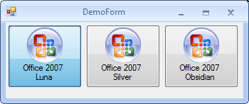

#SkinForm

### 1. 功能介绍 

	支持XML配置文件换肤

	可以自定义标题栏的高度

	可以自定义按钮的大小

	可以屏蔽不想要的默认按钮

### 2. 主要原理
	请参考 [WinForms Form Skin](http://www.codeproject.com/Articles/415102/WinForms-Form-Skin) 和 [Winforms SkinFramework](http://www.codeproject.com/Articles/61485/Winforms-SkinFramework)

